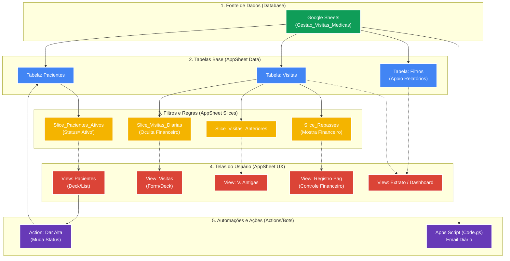

# Topologia do Aplicativo: Gestão de Visitas Médicas

Este diagrama ilustra o fluxo de informações, desde o banco de dados principal (Google Sheets) até as telas interativas (UX) que os usuários visualizam no AppSheet. Ele serve como referência rápida para o suporte e evolução da arquitetura do projeto.

## Diagrama da Arquitetura

## Resumo das Camadas

1. **Fonte de Dados:** Todo o armazenamento central e definitivo reside no Google Sheets.
2. **Tabelas Base:** O AppSheet espelha o modelo de dados e define os tipos, como obrigatoriedade, fórmulas iniciais (`UNIQUEID()`, `NOW()`) e relacionamentos (Ex: `ID_Paciente` sendo um *Ref*).
3. **Slices:** Camada de segurança e negócios. Os Slices garantem que a tela de visitas do dia a dia omita dados de faturamento financeiro e que a tela de pacientes só liste quem não recebeu alta.
4. **Telas (UX):** A interface final amarrada aos Slices. As mudanças feitas aqui alteram *como* a informação aparece, mas a regra vem das camadas de cima.
5. **Automações:** Ações que desencadeiam eventos, como o clique do botão "Dar Alta" ou o agrupamento de informações para envio de email do relatório pelo Google Apps Script.
